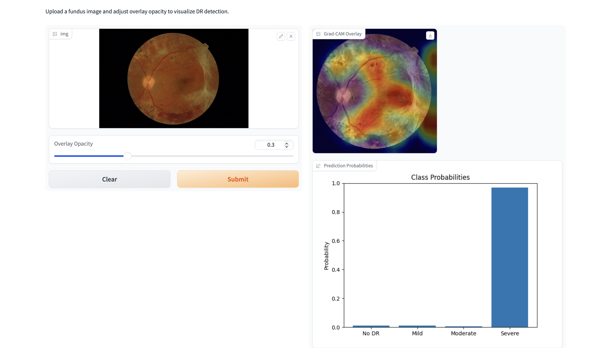

# Diabetic Retinopathy Detection using Deep Learning

This project implements a deep learning pipeline to classify Diabetic Retinopathy (DR) stages from fundus images using the MESSIDOR dataset. The models include CNN architectures like ResNet18 and DenseNet121, trained using PyTorch with augmentation, custom preprocessing, and evaluation metrics such as accuracy and AUC. 

The next steps are to perform self-supervised learning to see if this results in model improvement. Also some data augmentation will be explored and a binary mask will be applied to see if this yields a performance boost.

---

## 📁 Project Structure

```
DR_Training/ 
├── models/ # ResNet, DenseNet, and custom CNN definitions
├── utils/ # Helper functions (class weights, metrics, etc.)
├── data_loader.py # Dataset loading and splitting
├── dataset_class.py # PyTorch Dataset with OpenCV-based preprocessing
├── preprocess_class.py # Preprocessing pipeline (CLAHE, resizing)
├── transforms.py # Light, heavy, and test-time transforms
├── train.py # Training loop with metrics tracking
├── run_training.ipynb # Notebook interface for running training models
├── requirements.txt # Python dependencies
├── MESSIDOR/ # (Local) Folder for raw dataset
├── saved_models/ # Saved model weights for inference
├── THEIA_APP.py # Quick gradio web-app
└── README.md # This file
```

## 🧪 Features

- 🔍 **Model Architectures**: ResNet18, DenseNet121, SimpleCNN
- 🧼 **Preprocessing**: OpenCV with optional CLAHE and resizing
- 🎯 **Class Balancing**: Weighted loss with computed class weights
- 📊 **Metrics Tracked**: Accuracy, AUC (per epoch, CSV logged)
- 🔁 **Flexible Training**: Easily change model, learning rate, batch size, epochs
- 🧠 **Best Model Selection**: Saves best model by validation AUC

---

## 🚀 Quick Start

### 1. Clone the repo

```bash
git clone https://github.com/alexbohane/DR_Training.git
cd DR_Training
```

### 2. Create Environment
```bash
python -m venv .venv
source .venv/bin/activate
pip install -r requirements.txt
```

## DATA

Download data from the MESSIDOR 1 dataset website. On the official MESSIDOR website perform all suggested data cleaning manually (duplication removal, correcting labels)

## Gradio APP

To run the gradio app for inference, run the following:

```bash
python THEIA_APP.py
```

Here is a preview of the demo

 
